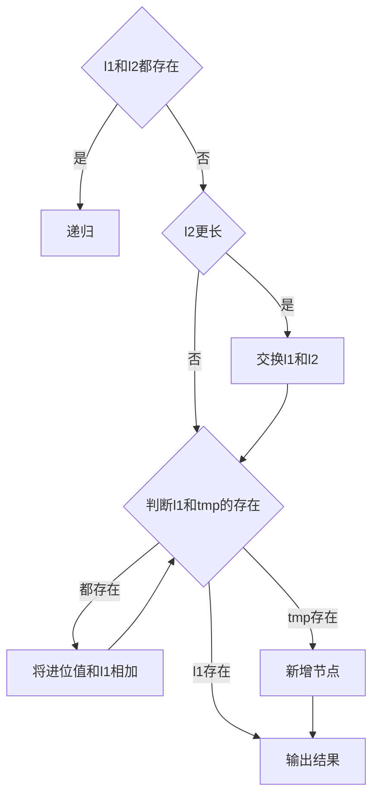

## 题意

给定两个**非空**链表，分别表示两个非负整数，每位数字按逆序存储，每个节点表示一位数字。将两个链表表示的数相加，并以同样的方式输出。

### eg.
**输入：**l1 = \[2,4,3\], l2 = \[5,6,4\]
**输出：** \[7,0,8\]
**解释：** 342 + 465 = 807.

### 示意图


### 提示
-   每个链表中的节点数在范围 `[1, 100]` 内
-   `0 <= Node.val <= 9`
-   题目数据保证列表表示的数字不含前导零

---
## 解题思路

- 因为链表的第一位是个位，以此类推，所以将两个链表从第一位开始相加，和除以十，判断进位(tmp)，余数留下。
- 具体的操作有两种方法：
- 法一：
	- 将更长的那个链表（假设是l1）作为返回的链表，将和的值加到l1上
	- 创造一个递归函数，根据不同的条件进行操作，具体的判断如下方流程图所示（节点的值相加完成后）



- 法二：
	- 创建新的链表，每一位计算后赋值到当前node并建立新的node
	- 将l1，l2和进位值三者作为while循环的条件，当l1和l2中的任一个不存在时，赋值为None，计算时加零
- 当不再存在进位或者链表遍历结束时，输出结果。

---
## 代码

### 法一

```python
class Solution:
	def addTwoNumbers(self,l1:ListNode,l2:ListNode)->ListNode:
		def sum(l1,l2,tmp):
			tmp+=l1.val+l2.val
			l1.val=tmp%10 #将余数赋值到当前节点
			tmp//=10 #tmp整除10后得到进位值
			if l1.next and l2.next:
				return sum(l1.next,l2.next,tmp)
			if l2.next:#如果l2更长，l1,l2互换
				l1.next=l2.next
			while l1.next and tmp:
				l1=l1.next
				tmp+=l1.val
				l1.val=tmp%10
				tmp//=10
			if tmp:
				l1.next=ListNode(1)
		
		sum(l1,l2,0)
		return l1
```

### 法二
```python
class Solution:
	def addTwoNumbers(self,l1:ListNode,l2:ListNode)->ListNode:
		cur=head=ListNode(None)
		tmp=0 
		while l1 or l2 or tmp:
			tmp+=(l1.val if l1 else 0)+(l2.val if l2 else 0)
			cur.next=ListNode(tmp%10)#创建新节点
			tmp//=10
			cur=cur.next
			l1 = l1.next if l1 else None
			l2 = l2.next if l2 else None
		return head.next
```
