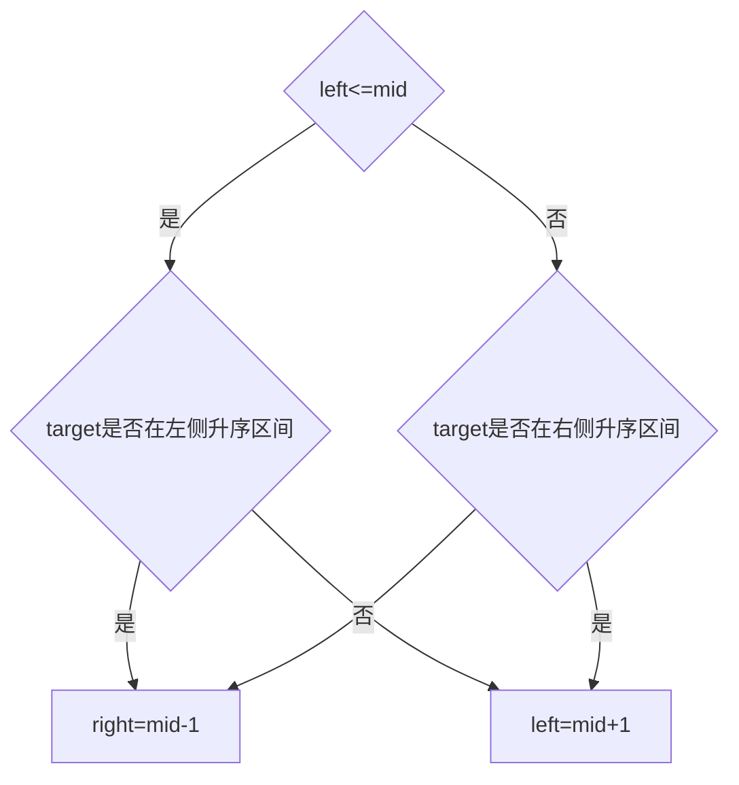

## 题意
升序排列的整数数组 nums 在预先未知的某个点上进行了旋转（例如， \[0,1,2,4,5,6,7] 经旋转后可能变为 \[4,5,6,7,0,1,2] ）。

请你在数组中搜索 target ，如果数组中存在这个目标值，则返回它的索引，否则返回 -1 。

---
## 解题

用**二分法** 把数组一分为二，取 **头、中、尾三个数** 进行比较，
- 如果left<=mid，说明左边是升序的，进而判断target是否在这个区间，
	- 若在这个区间，将right值设为mid-1
	- 若不在，left设为mid+1
- 否则右边是升序的，判断target是否在这个区间
	- 若在，left设为mid+1
	- 不在，rigt设为mid-1



---
## 代码
```python
if not nums:
	return -1
left=0
right=len(nums)-1
while left<=right:
	mid=(left+right)//2
	if nums[mid]==target:
		return mid

	if nums[left]<=nums[mid]:
		if nums[left]<=target<nums[mid]:
			right=mid-1
		else:
			left=mid+1
	else:
		if nums[mid]<target<=nums[right]:
			left=mid+1
		else:
			right=mid-1
return -1
```