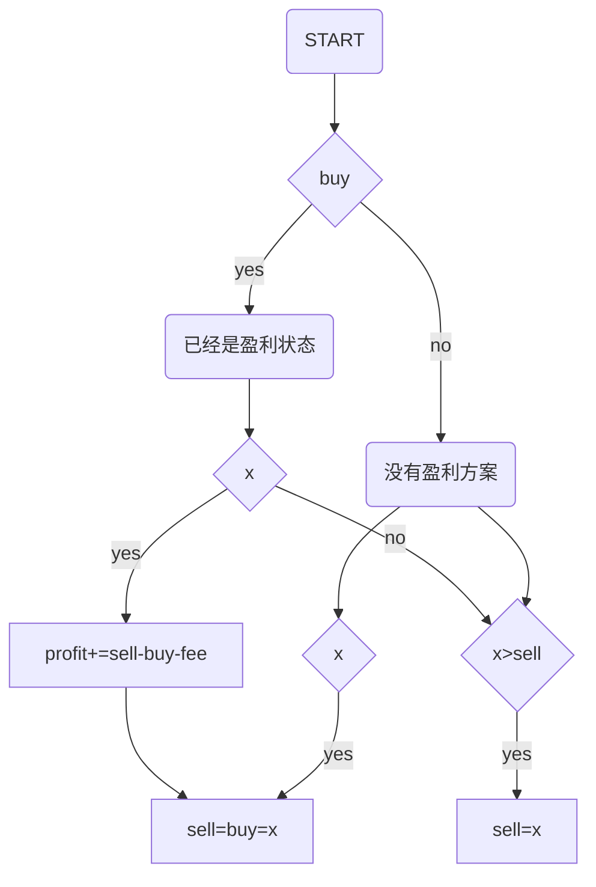

# 法一
代码如下：
	
```python
	class Solution:
		def maxProfit(self, prices: List[int], fee:int):
			profit = 0
			buy=sell=prices[0]
			
			for x in prices:
				if buy<sell-fee:#已经是盈利状态
					#0~sell-fee:卖出并进行下一单
					#sell-fee~sell:不做处理
					#sell++：选择下一个
					if x<sell-fee:
						profit+=(sell-buy-fee)
						buy=sell=x
					elif x>sell:
						sell=x
				else:
					if x>sell:
						sell=x
					if x<buy:
						buy=sell=x
				
			if buy<sell-fee:
				profit+=(sell-buy-fee)
				
			return profit
```

流程图：


# 法二

```python
n=len(prices)
if n<2:
	return 0

dp=[0,0]
dp[1]=-prices[0]-fee
#dp0为不持股时的最大收益
#dp1为持股时的最大收益

for i in range(1,n):
	dp[0]=max(dp[0],dp[1]+prices[i])
	dp[1]=max(dp[0]-prices[i]-fee,dp[1])
	
return dp[0]
```