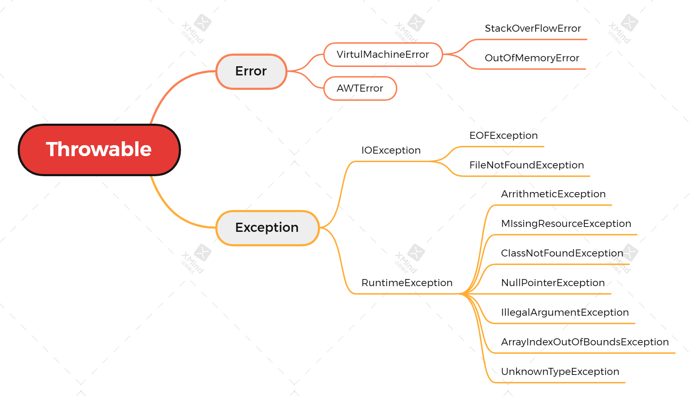

# 分类

## Error

一般指程序无法处理的错误，大多数和代码编写者无关。

比如java虚拟机运行错误，当 JVM 不再具备能继续执行操作所需的内存资源的时候，将出现 OutOfMemoryError。当这样的情况出现的时候，JVM 一般会选择线程终止。

## Exception

一般指程序本身可以处理的异常，又可以细分为 checked exceptions 和 unchecked exceptions

### checked exceptions 非运行时异常（编译异常）

通常是写代码的时候，需要去 try catch 的那种 exception，比如 IOException。

这类 Exception 是Java的设计者要求你的程序去处理的，这种异常一般不会影响程序的主体，容易手动诊断修复（所以需要在try catch 下面给出处理异常的代码）。

如果不处理，那么程序的编译就无法通过

### unchecked exceptions 运行时异常

都是 RuntimeException 类及其子类异常，即程序运行时终止，控制台出现的异常，比如：
- NullPointerException 空指针异常
- IndexOutOfBoundsException 下标越界异常
- ClassCastException 类转换异常
- ……