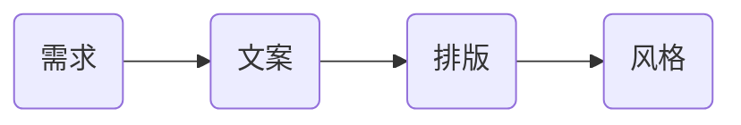
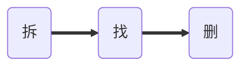

# 鸡蛋模型

鸡蛋的由内而外：

```mermaid
graph LR

第一层(需求) --> 第二层(文案) --> 第三层(排版) --> 第四层(风格)

```

# 文字的精简提炼

```mermaid
graph LR

A(拆) ==> B(找) ==> C(删)

```

# 搜图/图标技巧

**换词搜索：**
1. 换英文
2. 换同义词
3. 改用标签

# 其它

1. 巧用线条
2. 三分构图法
3. 巧用线框
4. 渐变色