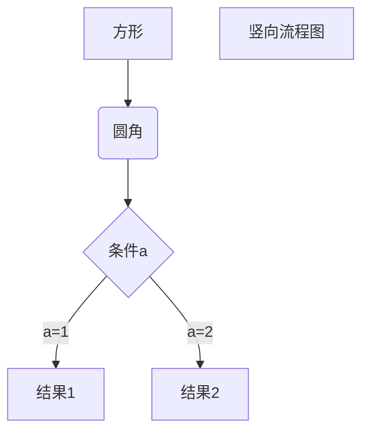
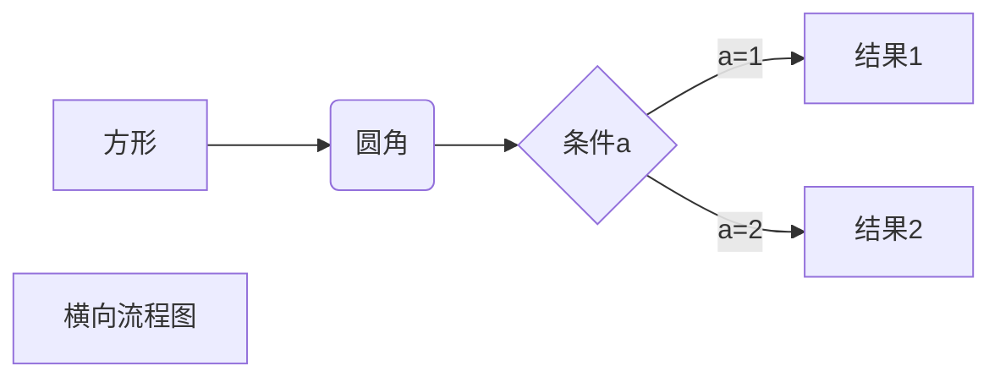
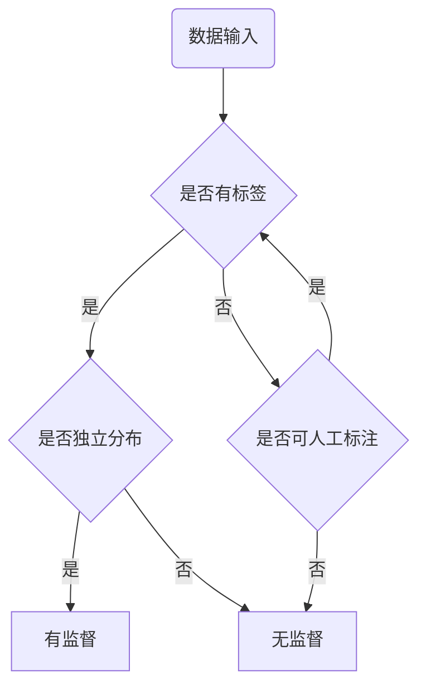

# MARKDOWN标题
- 一种方式 用 # 号

## 二级标题
### 三级标题
#### 四级标题
##### 五级标题
###### 六级标题


- 第二种方式 用 = 和 - 

现在是一级标题
===

现在是二级标题
---


# 字体

将字体改成斜体或者粗体可以采用两种方法：
* 在字的两侧加符号_或者*，如 _斜体字体_ *斜体字体*
* 或者直接选中字体，然后crl+B或者I

# 脚注

演示一下脚注，比如[^李白]

[^李白]: 李白是一位唐代诗人

# 分割线

两种符号

***

---

# 删除线

在需要删除的段落上两侧加上两个波浪号
删除文字
~~删除文字~~

# 下划线

通过HTML的标签来实现

<u> 带下划线文本 </u>
	

# 列表

* 第一项
* 第二项
* 第三项

- 第一项
- 第二项
- 第三项

+ 第一项
+ 第二项
+ 第三项

1. 第一项
2. 第二项
3. 第三项

列表嵌套

1. 第一项
	- 第一项第一个嵌套
	- 第一项第二个嵌套


# 区块

> 区块引用

> 区块嵌套
>> 再嵌套
>>> 再再嵌套
>>> 1. 第一项
>>> 2. > 套娃

# 代码

用反引号包围
`printf()` 函数

代码区块

四个空格或一个tab

	<?php
	echo 's'
	function test(){
		echo 'test'
	}

用三个``` 包裹一段代码，可以指定语言
```python
return 1 if isfalse else 0

```

```javascript
$(document).ready(function () {
    alert('RUNOOB');
});
```

# 链接

magi的链接[magi](https://magi.com)

或者

<https://magi.com>

高级链接，变量赋值在文档末尾进行

第一个链接[magi][1]
第二个链接[magi][2]

[1]:https://magi.com
[2]:https://magi.com


# 图片

感叹号!+方括号（图片的替代文字）+普通括号（图片的网址）


另一种方法，末尾赋值

![runoob][3]

[3]:http://static.runoob.com/images/runoob-logo.png

# 表格

|中间对齐|左|右|
|:-:|:-|-:|
|单元格|单元格|单元格|

# 流程图举例







# 支持html原色

目前支持的html元素有：\<kbd>\<b>\<i>\<em>\<sup>\<br>
	
使用 <kbd>Ctrl</kbd>+<kbd>Alt</kbd>+<kbd>Del</kbd> 重启电脑

# 转义

为了使一些特殊符号表示原来的含义，需要转义，markdown使用反斜杠转义特殊字符

**文本加粗**
\*\* 正常显示星号 \*\*

# 公式

当需要输入公式时，使用两个美元符号\$$ 包裹TeX或者LaTeX公式

$$
	x^2
	x~0~ 
	x^2_{ij}
$$

或者使用HTML标签

n<sup>2</sup>
n<sub>2</sub>