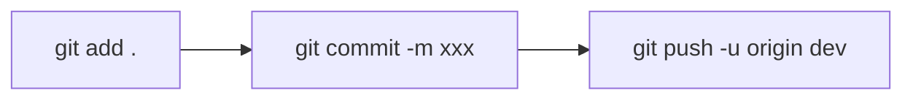
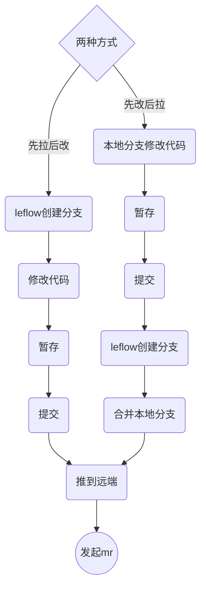

### git add 详解 ：
git add 的作用就是把变化提交到暂存区

|指令|含义|补充|
|:-:|:-:|:-:|
|
git add -A
|stage all changes|含 新增、修改、删除|
|git add .|stage new files and modifications, without deletions|含 修改和新文件，不含删除，确定是增量修改的话用这个|
 |git add -u|update，stage new modifications and deletions, without new files|含修改和删除，不含新增|
    

---

### git stash 详解

git stash 的作用就是将目前还不想提交的但是已经修改的内容保存至堆栈中，后续可以在某个分支上恢复出堆栈中的内容。

> stash 中的内容不仅仅可以恢复到原先开发的分支，也可以恢复到其它任意的分支上。git stash 的作用范围包括工作区和暂存区的内容（即，没提交的内容都会保存至堆栈区）

     

|指令|含义|
|:-:|:-:|
|
git stash
|暂存已 track 的文件的修改(不含新增）|
|git stash -a / --all|暂存所有修改，相当于 git add . + git stash|
|git stash save -a xxx|同上，区别是可以添加信息，方便区分各个 stash|
|git stash list|查看当前 stash 中的内容|
|git stash pop|将当前 stash 中的内容弹出，并应用到当前分支（先进后出）|
|git stash apply (xxx)|将堆栈中的内容应用到当前分支，和上面的区别是，该命令不会将内容从堆栈中删除（同一stash可多次应用），尾部增加分支名则可应用到指定分支|
|git stash drop xxx|从堆栈中移除指定 stash|
|git stash clear|清除堆栈中所有 stash|
|git stash show (-p)|查看堆栈中最新的 stash 和当前分支的差异，加上p可以查看详细信息|
|git stash branch|从最新的 stash 创建分支|    

### 创建分支相关

|指令|含义|
|:-:|:-:|
|
git branch xxx
|创建分支|
|git branch|查看当前所有分支|
|git checkout xxx|切换到xxx目录|
|git branch -d XXX|删除分支|
|git merge xxx|将xxx分支和当前分支合并|
|git log|查看当前各个分支所指向的对象（git 中有个名为 HEAD 的特殊指针，指向当前所在的分支）|
|git branch -v|查看每个分支最后一次提交|
|git branch --merged / --no-merged|当前已经/没有合并到当前分支的分支|
    

---

### 其它

|指令|含义|
|:-:|:-:|
|
git commit
|将暂存区内容提交到本地仓库|
|git pull|从远程获取代码并合并本地版本|

---

## 应用场景

#### 最常见的提交过程(假设在 dev 分支）

#### 将本地分支和远程分支合并

0. 查看远程仓库

> git remote -v 

1. 从远程拉取并创建新分支

> git fetch origin master:newlocalbranch

2. 查看新分支和本地原有分支的不同（当前在要比较的原分支）

> git diff newlocalbranch

3. 将新本地分支和原分支合并

> git merge newlocalbranch

4. 可删除拉取的分支（可选）

> git branch -D newlocalbranch

---

### 我的用法

如果是**针对已提交 mr 的补充修改**：

> 1.  git add .
> 2.  git commit -m xxx
> 3.  git leflow push (-p)

如果是**发起新的mr**，有两种方式：
1. 先拉后改：先用leflow创建分支（会同时在远端和本地创建），然后修改代码，最后提交，发起mr
2. 先改后拉：基于本地的分支修改代码，然后用leflow创建分支，切换到新分支后与原本地分支合并，再提交，发起mr

补充：
1. leflow 创建分支：git leflow branch -n xxx 同时在远端和本地创建一个新分支（会基于当前远端的 master）
2. 推到远端： git leflow push
3. 发起mr： git leflow mr -t xxx