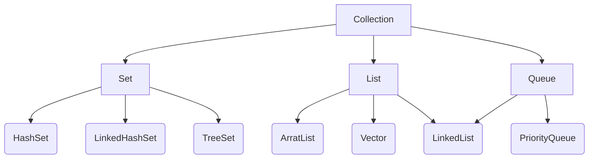

[来源](https://blog.csdn.net/zhangqunshuai/article/details/80660974)
# 概述

- List，Set，Map 都是接口，前两个继承自 Collection，而 Map 为独立接口
- Set 下还包含 HashSet，LinkedHashSet，TreeSet
- List 下含有 ArrayList，Vector，LinkedList
- Map 下含有 HashTable，LinkedHashMap，HashMap，TreeMap
- Collection 下还有个 Queue 接口，有 PriorityQueue 类

# Collection

- List: 有序，可重复
  - ArrayList
    - 优点：底层数据结构是数组，查询快，效率高
    - 缺点：增删慢，线程不安全
  - Vector
    - 优点：底层数据结构是数组，查询快，线程安全
    - 缺点：增删慢，效率低
  - LinkedList
    - 优点：底层数据结构是链表，增删快，效率高
    - 缺点：线程不安全，查询慢

表格展示：
||ArrayList|Vector|LinkedList|
|:-:|:-:|:-:|:-:|
|底层数据结构|数组|数组|链表|
|查询|快|慢|快|
|效率|高|低|高|
|增删|快|快|慢|
|线程|不安全|安全|不安全|

- Set：无序，唯一
  - HashSet
    - 底层数据结构是哈希表（无序，唯一）
    - 如何保证元素唯一性？ 依赖于两个方法
      - hashCode()
      - equals()
  - LinkedHashSet
    - 底层数据结构是链表和哈希表（FIFO插入有序，唯一）
      - 由链表保证元素有序
      - 由哈希表保证元素唯一
  - TreeSet
    - 底层数据结构是红黑树（唯一，有序）
    - 如何保证元素排序？
      - 自然排序
      - 比较器排序
    - 如何保证元素唯一性？
        根据比较的返回值是否为0来决定

Collection集合如何选择：
- 是否唯一？
  - 唯一：选 Set
    - 是否排序？
      - 是：TreeSet 或 LinkedHashSet
      - 否：HashSet
    - 如果知道是Set，但不知道哪个Set，就用HashSet
  - 不唯一：选 List
    - 是否安全：
      - 是： Vectoe
      - 否： ArrayList 或 LinkedList
        - 查询多：ArrayList
        - 增删多：LinkedList
    - 如果是 List，但不知道哪个List，就用 ArrayList
- 如果你知道是Collection集合，但是不知道使用谁，就用ArrayList。
- 如果你知道用集合，就用ArrayList。

# Map

Map 接口有三个比较重要的实现类
- 是否有序？
  - 有序：TreeMap
  - 无序：HashTable HashMap
    - 是否同步？
      - 同步：HashTable
      - 不同步：HashMap

比较：
- HashTable
  - 线程安全
  - 效率较低
  - 不允许null值
  - 父类是 Dictionary
- HashMap
  - 非线程安全
  - 效率较高
  - 允许null值（key 和 value 都允许）
  - 父类是 AbstractMap

# 重点问题分析

### TreeSet，LinkedHashSet 和 HashSet 的区别

1. 介绍

> 这三个在 java 中都是实现set的数据结构

- TreeSet 的主要功能用于排序
- LinkedHashSet 的主要功能用于保证FIFO（即有序，先进先出）
- HashSet 只是通用的存储数据的集合

2. 相同点

- 不包含重复元素
- 都不是线程安全

3. 不同点

- 插入数据速度排序（由快到慢）：HashSet-->LinkedHashSet-->TreeSet
> TreeSet 最慢是因为它要实现内部排序

- 有序性
  - HashSet 不保证有序
  - LinkedHashSet 保证FIFO，即按插入顺序排序
  - TreeSet 内部实现排序，也可自定义排序
- null
  - HashSet 和 LinkedHashSet 允许存在null数据
  - TreeSet 不可插入 null 数据

