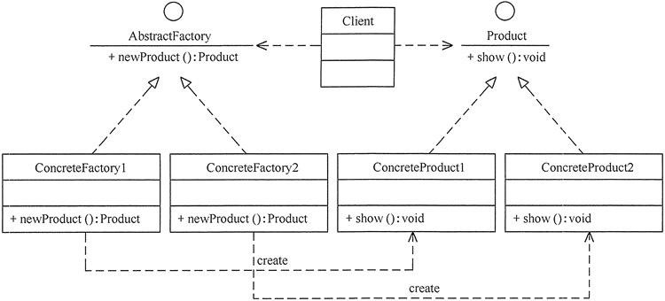

## 设计模式的分类：

- 按照目的来分（完成什么工作）
	- **创建型模式**
		- 用于描述 “怎样创建对象”
		- 主要特点是**将对象的创建和使用分离**
		- 包含：单例、原型、工厂方法、抽象工厂、建造者
	- **结构型模式**
		- 用于描述 “如何将 类 或 对象 按某种布局组成更大的结构”
		- 包含：代理、适配器、桥接、装饰、外观、亨元、组合
	- **行为型模式**
		- 用于描述 “类 和 对象 间怎样相互协作，共同完成单个对象都无法完成的任务，以及怎样分配职责”
		- 包含：模板方法、策略、命令、职责链、状态、观察者、中介者、迭代器、访问者、备忘录、解释器
- 按作用范围来分（主要用于类上还是对象上）
	- **类模式**
		- 用于处理 “类和子类之间的关系”，这些关系通过继承来建立，是静态的，在编译时确定
		- 包含：工厂方法、（类）适配器、模板方法、解释器
	- **对象模式**
		- 处理 “对象之间的关系”，这些关系可以通过组合或聚合来实现，运行时可以变化
		- 包含：除了上面四种

具体分类见下表

|分类|创建型模式|结构型模式|行为型模式|
|:-:|:-:|:-:|:-:|
|类模式|工厂方法|（类）适配器|模板方法、解释器|
|对象模式|单例<br>原型<br>抽象工厂<br>建造者|代理<br>（对象）适配器<br>桥接<br>装饰<br>外观<br>亨元<br>组合|策略<br>命令<br>职责链<br>状态<br>观察者<br>中介者<br>迭代器<br>访问者<br>备忘录

对 23 各设计模式的简单介绍：
1. 单例（Singleton）模式：某个类只能生成一个实例。该类提供一个全局访问点供外部获取该实例，可以拓展为有限多例模式
2. 原型（Prototype）模式：将一个对象作为原型，通过对其进行复制得到多个类似的新实例
3. 工厂方法（Factory Method）模式：定义一个用于创建产品的接口，子类来决定生产什么产品
4. 抽象工厂（AbstractFactory）模式：提供一个创建产品族的接口，其每一个子类可以生产一系列相关的产品
5. 建造者（Builder）模式：将一个复杂对象分解为多个相对简单的部分，然后根据不同的需要分别创建它们，最后再构造这个复杂对象
6. 代理（Proxy）模式：为某对象提供一种代理以控制对该对象的访问。即客户端通过代理间接地访问该对象，从而限制、增强或修改该对象的一些特性
7. 适配器（Adapter）模式：将一个类的接口转换成客户希望的另外一个接口，这样做的目的是让那些原本因为接口不兼容而不能一起工作的类能一起工作
8. 桥接（Bridge）模式：将抽象和实现分离，使它们可以独立变化
9. 装饰（Decorater）模式：动态地给对象增加一些职责，来增加其额外功能
10. 外观（Facade）模式：为多个复杂的子系统提供一个一致的接口，提高它们的可访问性
11. 亨元（Flyweight）模式：运用共享技术来有效地支持大量细粒度对象的使用
12. 组合（Composite）模式：将对象组合成树状层次结构，让用户对单个对象和组合对象具有一致的访问性
13. 模板方法（TemplateMethod）模式：定义一个操作中的算法骨架，而将算法的一些步骤延迟到子类中，使得子类可以不改变该算法结构的情况下重定义该算法的某些特定步骤。
14. 策略（Strategy）模式：定义了一系列算法，并将每个算法封装起来，使它们可以相互替换，且算法的改变不会影响使用算法的客户。
15. 命令（Command）模式：将一个请求封装为一个对象，使发出请求的责任和执行请求的责任分割开。
16. 职责链（Chain of Responsibility）模式：把请求从链中的一个对象传到下一个对象，直到请求被响应为止。通过这种方式去除对象之间的耦合。
17.  状态（State）模式：允许一个对象在其内部状态发生改变时改变其行为能力。
18.  观察者（Observer）模式：多个对象间存在一对多关系，当一个对象发生改变时，把这种改变通知给其他多个对象，从而影响其他对象的行为。
19.  中介者（Mediator）模式：定义一个中介对象来简化原有对象之间的交互关系，降低系统中对象间的耦合度，使原有对象之间不必相互了解。
20.  迭代器（Iterator）模式：提供一种方法来顺序访问聚合对象中的一系列数据，而不暴露聚合对象的内部表示。
21.  访问者（Visitor）模式：在不改变集合元素的前提下，为一个集合中的每个元素提供多种访问方式，即每个元素有多个访问者对象访问。
22.  备忘录（Memento）模式：在不破坏封装性的前提下，获取并保存一个对象的内部状态，以便以后恢复它。
23.  解释器（Interpreter）模式：提供如何定义语言的文法，以及对语言句子的解释方法，即解释器。


## 详细记录

### 单例模式

- 定义：顾名思义，一个类只有一个实例，且该类能自行创建这个实例。

举个栗子：Windows中只能打开一个任务管理器、回收站

- 特点：
	1. 单例类只有一个实例对象
	2. 该单例对象必须由单例类自行创建
	3. 单例类对外提供一个访问该单例的全局访问点

- 优点：
	- 因为只有一个实例，可以减少内存的开销
	- 可以避免对资源的多重占用
	- 设置了全局访问点，可以优化共享资源的访问
- 缺点
	- 单例模式一般没有接口，扩展比较困难
	- 在并发测试中不利于代码调试
	- 单例的代码通常写在一个类中，如果功能设计不合理，很容易违背单一职责原则

- Java中单例的使用场景
	- 需要频繁创建一些类，使用单例可以降低系统的内存压力，减少GC
	- 某类只要求生成一个对象的时候，如一个班中的班长，每个人的身份证号
	- 某些类创建实例占用的资源较多，或实例化耗时长、经常使用
	- 某类需要频繁初始化，而创建的对象又频繁被销毁的时候
	- 频繁访问数据库或文件的对象

#### 单例模式的结构
主要包含以下角色：
- 单例类：包含一个实例且能自行创建这个实例的类
- 访问类：使用单例的类

#### 单例模式的实现

通常有两种实现形式

1. 懒汉式单例

该模式的特点是，类加载的时候没有生成单例，只有当第一次调用getInstance方法的时候才去创建这个单例
```java
public class LazySingleton {
    private static volatile LazySingleton instance = null;    //保证 instance 在所有线程中同步
	
    private LazySingleton() {
    }    //private 避免类在外部被实例化
	
    public static synchronized LazySingleton getInstance() {
        //getInstance 方法前加同步
        if (instance == null) {
            instance = new LazySingleton();
        }
        return instance;
    }
}
```

注意：如果是多线程程序，不能删除上例代码中的关键字 volatile 和 synchronized，不然的话会存在线程非安全的问题。

懒汉式单例的缺点在于，每次访问都要同步，会影响性能，且消耗更多资源。

2. 饿汉式单例

和懒汉式相对，饿汉式一旦类被创建了，就会创建一个单例，保证在getInstance方法之前单例就已经存在

```java
public class HungrySingleton {
	private static final HungrySingleton instance = new HungrySingleton();
	
	private HungrySingleton() {
	}
	
	public static HungrySingleton getInstance() {
		return instance;
	}
}
```

因为饿汉式单例在类创建的同时就已经创建好了一个静态的对象供系统使用，以后不再改变，所以是线程安全的。
可以直接用于多线程而不会出现问题。

### 工厂模式

在日常开发中，有需要生成复杂对象的地方，都可以考虑使用工厂模式来代替。

**定义**： 定义一个创建产品对象工厂接口，然后把产品对象的实际创建工作推迟到具体工厂子类中。  这恰恰满足了 创建型模式 中所要求的 “创建和使用相分离” 的特点。

按照业务场景划分，可以分为：
- 简单工厂模式
- 工厂方法模式
- 抽象工厂模式

我们把创建的对象称为“产品”，把创建产品的对象称为“工厂”。那么如果创建的产品不多，只需一个工厂就可以完成，这种模式就叫做：简单工厂模式

简单工厂模式中创建实例的方法通常是静态（static）方法，所以简单工厂模式（Simple Factory Pattern）又被叫做静态工厂方法模式（Static Factory Method Pattern）

简单地说，简单工厂模式有一个具体的工厂类，可以生成多个不同的产品，属于创建型设计模式，它不在gof23中设计模式中

简单工厂的问题在于，每增加一个产品就要增加一个具体产品类和一个对应的具体工厂类，这就增加了系统的复杂度，违背了“开闭原则”

### 工厂方法模式

优点：
- 用户只需要知道具体工厂的名称就可以得到所要的产品，无需知道产品的创建过程
- 灵活性增强，对于新产品，只需多写一个相应的工厂类

缺点：
- 类的个数容易过多，增加复杂度
- 增加了系统的抽象性和理解难度
- 抽象产品只能生产一种产品

应用场景：
- 客户只知道创建产品的工厂名，而不知道具体的产品名。如TCL电视工厂，海信电视工厂
- 客户不关心创建产品的细节，只关心产品的品牌

模式的结构：
- 抽象工厂（AbstractFactory）：主要提供了创建产品的接口，调用者通过它来访问具体工厂的工厂方法newProduct()来创建产品
- 具体工厂（ConcreteFactory）：主要是实现抽象工厂中的抽象方法，完成具体产品的创建
- 抽象产品（Product）：定义了产品的规范，描述了产品的主要特性和功能
- 具体产品（ConcreteProduct）：实现了抽象产品角色所定义的接口，由具体工厂来创建，它与具体工厂之间一一对应



```java
package FactoryMethod;
public class AbstractFactoryTest {
    public static void main(String[] args) {
        try {
            Product a;
            AbstractFactory af;
            af = (AbstractFactory) ReadXML1.getObject();
            a = af.newProduct();
            a.show();
        } catch (Exception e) {
            System.out.println(e.getMessage());
        }
    }
}
//抽象产品
interface Product {
    public void show();
}
//具体产品1
class ConcreteProduct1 implements Product {
    public void show() {
        System.out.println("具体产品1显示...");
    }
}
//具体产品2
class ConcreteProduct2 implements Product {
    public void show() {
        System.out.println("具体产品2显示...");
    }
}
//抽象工厂
interface AbstractFactory {
    public Product newProduct();
}
//具体工厂1
class ConcreteFactory1 implements AbstractFactory {
    public Product newProduct() {
        System.out.println("具体工厂1生成-->具体产品1...");
        return new ConcreteProduct1();
    }
}
//具体工厂2
class ConcreteFactory2 implements AbstractFactory {
    public Product newProduct() {
        System.out.println("具体工厂2生成-->具体产品2...");
        return new ConcreteProduct2();
    }
}
```